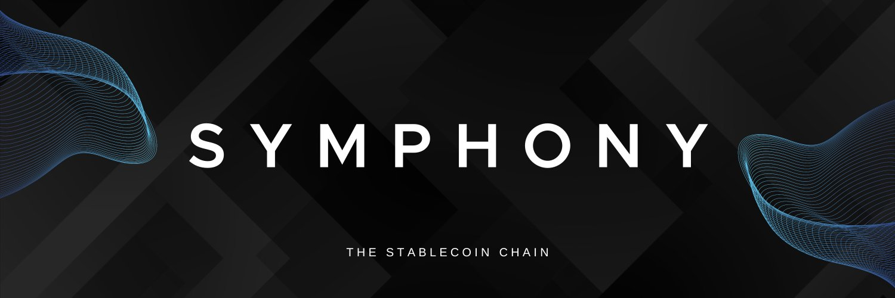

# Symphony



[](https://www.repostatus.org/#active)
[](https://pkg.go.dev/github.com/osmosis-labs/osmosis/v11)
[](https://goreportcard.com/report/github.com/osmosis-labs/osmosis/v11)
[](https://github.com/osmosis-labs/osmosis/releases/latest)
[](https://github.com/osmosis-labs/osmosis/blob/main/LICENSE)
[](https://github.com/osmosis-labs/osmosis)
[](https://github.com/marketplace/actions/super-linter)
[](https://discord.gg/osmosis)

Symphony offers truly decentralized tokenization of real-world assets (RWAs), with safeguards that ensure successful scaling down to zero, withdrawing all users at value properly and securely. Symphony provides a robust and secure platform for the tokenization of assets such as real estate, commodities, and other tangible assets, allowing users to invest and trade these assets in a decentralized manner.

As a true Layer 1 appchain, Symphony has greater control over the full blockchain stack than traditional smart contract platforms, which must follow the code of the parent chain. This fine-grained control has enabled the development of unique features that enhance security and scalability. The customizability of appchains allows Symphony to implement advanced safeguards and mechanisms to ensure that users' assets are always protected.

Symphony is bringing the decentralized finance (DeFi) experience to the world of real-world assets by building a platform that aims to integrate various asset classes into the blockchain ecosystem. To reach this goal, Symphony hosts an ever-expanding suite of DeFi applications, including lending/borrowing, staking, DEXs, etc. - providing all the functionalities that traditional financial systems offer, but in a trust-minimized and decentralized environment.

## System Requirements

This system spec has been tested by many users and validators and found
to be comfortable:

- Quad Core or larger AMD or Intel (amd64) CPU
  - ARM CPUs like the Apple M1 are not supported at this time.
- 64GB RAM (A lot can be in swap)
- 1TB NVMe Storage
- 100MBPS bidirectional internet connection

You can run Symphony on lower-spec hardware for each component, but you
may find that it is not highly performant or prone to crashing.

## Documentation

For the most up to date documentation please visit
[orchestralabs.org/documentation](https://orchestralabs.org/documentation/)

## Joining the Mainnet

[Please visit the official instructions on how to join the Mainnet
here.](https://docs.osmosis.zone/overview/validate/joining-mainnet)

Thank you for supporting a healthy blockchain network and community by
running an Osmosis node!

## Contributing

The contributing guide for Symphony explains the branching structure, how
to use the SDK fork, and how to make / test updates to SDK branches.

## LocalOsmosis

LocalOsmosis is a containerized local Osmosis testnet used for trying out new features locally.
LocalOsmosis documentation can be found [here](https://github.com/osmosis-labs/osmosis/tree/main/tests/localosmosis)

To utilize LocalOsmosis, follow these steps:

1. **Build the project:**

   ```bash
   make build
   ```

2. **Add `symphonyd` to PATH:**

   ```bash
   export PATH="$PATH:$HOME/path_to_your_project/build"
   ```

   Replace `"$HOME/path/to/your/project/build"` with the actual path to the `build` directory in your project.

3. **Configure localnet:**

   Before executing the script, ensure it has the necessary permissions.
   You can grant permission by running:

   ```bash
   chmod +x ./scripts/multinode-local-testnet.sh
   ```

   Then, run the script:

   ```bash
   ./scripts/multinode-local-testnet.sh
   ```

4. **Start localnet:**
   ```bash
   symphonyd start --home=$HOME/.symphonyd/validator1
   ```

These steps ensure the proper setup and execution of LocalOsmosis for your use.
